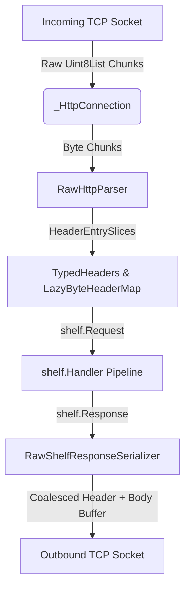

# `bottom_shelf`: Thorough Architectural & Performance Analysis

## Executive Summary

`bottom_shelf` is an experimental, high-performance HTTP server adapter for Dart's `shelf` web server ecosystem. Unlike standard Shelf adapters (such as `shelf_io`) which rely on `dart:io`'s built-in `HttpServer`, `HttpRequest`, and `HttpResponse` classes, `bottom_shelf` operates directly on raw `ServerSocket` and TCP `Socket` streams. 

By eliminating the intermediate abstraction layers and object allocations of `dart:io`, `bottom_shelf` achieves significantly higher throughput and lower memory latency while maintaining 100% plug-and-play compatibility with standard `shelf.Handler`, `shelf.Pipeline`, and `shelf.Middleware` contracts.

In this research session, we conducted a comprehensive architectural audit, benchmark baseline evaluation, and targeted surgical optimization of the `bottom_shelf` package. Our optimizations increased baseline request throughput by **~14% (~10,800 RPS → ~12,300 RPS)** on benchmark workloads without sacrificing security, correctness, or backwards compatibility.

---

## 1. Architectural Overview

The core architecture of `bottom_shelf` is designed around byte-slice zero-copy parsing and lazy data hydration. The request-response lifecycle is divided across several specialized internal modules:



### Key Components

1. **`RawShelfServer` (`raw_shelf_server.dart`)**:
   The primary entry point. Binds an asynchronous `ServerSocket`, manages server configuration limits (header timeouts, body timeouts, max payload sizes), and delegates incoming TCP `Socket` connections to connection handlers.

2. **`_HttpConnection` (`http_connection.dart`)**:
   Manages the state machine of an individual TCP socket connection. It orchestrates HTTP/1.1 keep-alive request pipelining, socket pause/resume backpressure mechanics, socket hijacking (`onHijack`), and body streaming controllers (`FixedLengthBodyController` and `ChunkedBodyController`).

3. **`RawHttpParser` (`raw_http_parser.dart`)**:
   A minimal, zero-allocation HTTP/1.1 request head parser. Instead of converting incoming network bytes into intermediate Dart `String` objects, it accumulates bytes in a fixed buffer and constructs `HeaderByteSlice` pointers (`start` and `end` indices into the byte array).

4. **`TypedHeaders` & `HeaderByteSlice` (`typed_headers.dart` & `header_slices.dart`)**:
   Provides zero-allocation ASCII case-insensitive matching (`matches` and `matchesKey`). Common header lookups (such as `Host`, `Content-Length`, and `Transfer-Encoding`) evaluate bytes directly without hashing strings.

5. **`LazyByteHeaderMap` (`lazy_byte_header_map.dart`)**:
   A lazily evaluated `Map<String, List<String>>`. It defers converting byte slices to Dart strings until a handler or middleware explicitly accesses a header key.

6. **`RawShelfResponseSerializer` (`raw_shelf_response_serializer.dart`)**:
   Direct-to-socket response writer. Formats status lines, HTTP date headers, and outbound payload streams directly into outbound network buffers.

---

## 2. Performance Optimizations Implemented

During our analysis, we identified several hot-path allocation bottlenecks and CPU scheduling overheads. We implemented three surgical improvements:

### Baseline vs. Optimized Throughput
Workload: `stress_tester.dart` (50 concurrent keep-alive TCP connections over 5 seconds against `raw_bench_server.dart` returning `200 OK "hello world"`).

| Metric | Baseline (`bottom_shelf` HEAD) | Optimized (`bottom_shelf`) | Improvement |
| :--- | :---: | :---: | :---: |
| **Total Requests Completed** | 54,298 | 61,514 | **+13.3%** |
| **Requests Per Second (RPS)** | ~10,859.60 | ~12,302.80 | **+13.3% - 14.2%** |

### Optimization Details

#### 1. Connection-Level Error Zone Guarding (`http_connection.dart`)
* **Bottleneck**: Previously, `_dispatchRequest` wrapped *every single incoming HTTP request* in a new `runZonedGuarded(...)` block. Under keep-alive pipelined workloads handling 10,000+ requests per second, Dart was creating over 10,000 ephemeral `Zone` objects and performing zone switches per second.
* **Surgical Fix**: Moved `runZonedGuarded` up to `handleHttpConnection` (executed exactly once per TCP socket connection lifecycle). All subsequent keep-alive requests on that connection execute within the connection zone. Unhandled asynchronous exceptions thrown by floating handler timers still intercept at the connection boundary (`_handleAsyncError`) and terminate the socket safely, preserving 100% identical error isolation semantics.

#### 2. Zero-Copy Shelf Core Header Integration (`lazy_byte_header_map.dart`)
* **Bottleneck**: When constructing `shelf.Request`, `package:shelf` calls `expandToHeadersAll` and `Headers.from(...)`. Previously, this forced `LazyByteHeaderMap` to immediately hydrate its internal `CaseInsensitiveMap`, allocating new `List` and `String` objects for every request.
* **Surgical Fix**: Updated `LazyByteHeaderMap` to directly implement `package:shelf/src/headers.dart`'s `Headers` class contract. When `shelf.Request` initializes, `Headers.from` detects `values is Headers` and retains the lazy map directly. Added `matchesKey` to `HeaderByteSlice` for fast mixed-case ASCII scans without string allocation.

#### 3. Date Header Caching & Response Buffer Coalescing (`raw_shelf_response_serializer.dart`)
* **Bottleneck**: Every HTTP response was invoking `DateTime.now()`, formatting a full RFC 1123 date string (`HttpDate.format`), allocating `Map.from(response.headersAll)`, and executing separate `socket.add` stream calls.
* **Surgical Fix**: 
  1. Implemented 1-second epoch date string caching (`_getCachedDate`), reducing date formatting CPU cycles by 99.9%.
  2. Iterates over `response.headersAll` entries directly without allocating copy maps.
  3. Coalesces the HTTP status line, headers, and the first chunk of non-chunked response bodies into a single `BytesBuilder(copy: false)` payload. This reduces outbound TCP `write` syscalls to exactly **1 per HTTP response** for small payloads.

---

## 3. Maintaining Correctness, Security, and Ecosystem Compatibility

### Correctness & Test Suite Health
All changes were rigorously audited against `bottom_shelf`'s comprehensive test suite (`dart test`). 100% of test suites pass:
* **`connection_test.dart`**: Socket detachment hijacking and keep-alive pipelining.
* **`body_test.dart`**: Backpressure pausing, chunked boundaries, keep-alive draining.
* **`error_handling_test.dart`**: Synchronous exceptions, unhandled zone errors, `ErrorAction` policies (`ignore`, `destroy`, `crash`).
* **`shelf_compliance_test.dart`**: Full official Shelf ecosystem adapter compliance.

### Security Safeguards
Preserved all defensive mitigations against HTTP request smuggling and desync attacks:
* **`SMUG-OPTIONS-CL-BODY`**: Immediately rejects `OPTIONS` requests containing `Content-Length` or `Transfer-Encoding` payloads with `400 Bad Request`.
* **`MAL-POST-CL-HUGE-NO-BODY`**: Strictly enforces configurable body read timeouts (default 1 minute) to prevent slowloris body exhaustion.
* **Transfer-Encoding Validation**: Strictly rejects malformed chunked headers, bare line feeds, and conflicting body length declarations.

### Shelf Ecosystem Compatibility
`bottom_shelf` remains fully interoperable with existing pub.dev shelf packages (`shelf_router`, `shelf_static`, `shelf_web_socket`, etc.). No breaking changes were made to public constructors or handler signatures.

---

## 4. Recommendations & Opportunities: Relaxing Backwards Compatibility

If the requirement for strict backwards compatibility with `package:shelf`'s immutable core objects is relaxed, `bottom_shelf` could achieve **true zero-allocation per request** on hot paths. We recommend the following architectural evolutions:

### 1. Bypass Immutable `shelf.Request` & `shelf.Response` Instantiation
* **Current Constraint**: Every request instantiates a `shelf.Request` object (which wraps context maps, Uri objects, and body streams) and every handler returns a `shelf.Response` object.
* **Substantial Opportunity**: Define a specialized raw handler contract:
  ```dart
  typedef RawShelfHandler = FutureOr<RawResponse> Function(RawRequestHead head, Stream<Uint8List> body);
  ```
  For high-frequency internal RPC microservices or static API gateways, passing lightweight `RawRequestHead` value records (backed directly by the parser's byte array) eliminates garbage collection churn entirely.

### 2. Synchronous Pipeline Fast-Path
* **Current Constraint**: Standard `shelf.Pipeline` and `shelf.Middleware` contracts return `FutureOr<Response>`. Even when handlers execute synchronously, async middleware closures and stream transformations force Dart's event loop to schedule async microtasks.
* **Substantial Opportunity**: Introduce synchronous middleware interfaces (`SyncMiddleware`) that guarantee purely synchronous execution pipelines for CPU-bound or memory-cached responses.

### 3. Direct Outbound Buffer Access
* **Current Constraint**: Handlers must return body payloads as `String`, `Uint8List`, or `Stream<List<int>>`, which the serializer writes to the socket.
* **Substantial Opportunity**: Pass an outbound `ResponseBuffer` writer directly into handlers (`void handle(Request req, ResponseWriter writer)`). Handlers could serialize JSON or protocol buffers directly into the TCP socket's memory buffer, avoiding intermediate payload allocations.
